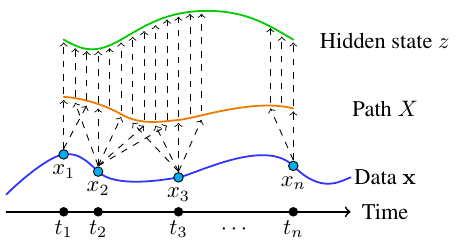

<h1 align='center'>torchcde</h1>
<h2 align='center'>Differentiable GPU-capable solvers for CDEs</h2>

**Update: for any new projects, I would now recommend using [Diffrax](https://github.com/patrick-kidger/diffrax) instead. This is much faster, and producion-quality. torchcde was its prototype as a research project!**

This library provides differentiable GPU-capable solvers for controlled differential equations (CDEs). Backpropagation through the solver or via the adjoint method is supported; the latter allows for improved memory efficiency.

In particular this allows for building [Neural Controlled Differential Equation](https://github.com/patrick-kidger/NeuralCDE) models, which are state-of-the-art models for (arbitrarily irregular!) time series. Neural CDEs can be thought of as a "continuous time RNN".

---

<p align="center">

</p>

## Installation

```bash
pip install torchcde
```

Requires PyTorch >=1.7.

## Example
```python
import torch
import torchcde

# Create some data
batch, length, input_channels = 1, 10, 2
hidden_channels = 3
t = torch.linspace(0, 1, length)
t_ = t.unsqueeze(0).unsqueeze(-1).expand(batch, length, 1)
x_ = torch.rand(batch, length, input_channels - 1)
x = torch.cat([t_, x_], dim=2)  # include time as a channel

# Interpolate it
coeffs = torchcde.hermite_cubic_coefficients_with_backward_differences(x)
X = torchcde.CubicSpline(coeffs)

# Create the Neural CDE system
class F(torch.nn.Module):
    def __init__(self):
        super(F, self).__init__()
        self.linear = torch.nn.Linear(hidden_channels,
                                      hidden_channels * input_channels)

    def forward(self, t, z):
        return self.linear(z).view(batch, hidden_channels, input_channels)

func = F()
z0 = torch.rand(batch, hidden_channels)

# Integrate it
torchcde.cdeint(X=X, func=func, z0=z0, t=X.interval)
```

See [time_series_classification.py](./example/time_series_classification.py), which demonstrates how to use the library to train a Neural CDE model to predict the chirality of a spiral.

Also see [irregular_data.py](./example/irregular_data.py), for demonstrations on how to handle variable-length inputs, irregular sampling, or missing data, all of which can be handled easily, without changing the model.

## Citation
If you found use this library useful, please consider citing

```bibtex
@article{kidger2020neuralcde,
    title={{N}eural {C}ontrolled {D}ifferential {E}quations for {I}rregular {T}ime {S}eries},
    author={Kidger, Patrick and Morrill, James and Foster, James and Lyons, Terry},
    journal={Advances in Neural Information Processing Systems},
    year={2020}
}
```

## Documentation

The library consists of two main components: (1) integrators for solving controlled differential equations, and (2) ways of constructing controls from data.

### Integrators

The library provides the `cdeint` function, which solves the system of controlled differential equations:
```
dz(t) = f(t, z(t))dX(t)     z(t_0) = z0
```

The goal is to find the response `z` driven by the control `X`. This can be re-written as the following differential equation:
```
dz/dt(t) = f(t, z)dX/dt(t)     z(t_0) = z0
```
where the right hand side describes a matrix-vector product between `f(t, z)` and `dX/dt(t)`.

This is solved by
```python
cdeint(X, func, z0, t, adjoint, backend, **kwargs)
```
where letting `...` denote an arbitrary number of batch dimensions:
* `X` is a `torch.nn.Module` with method `derivative`, such that `X.derivative(t)` is a Tensor of shape `(..., input_channels)`,
* `func` is a `torch.nn.Module`, such that `func(t, z)` returns a Tensor of shape `(..., hidden_channels, input_channels)`,
* `z0` is a Tensor of shape `(..., hidden_channels)`,
* `t` is a one-dimensional Tensor of times to output `z` at.
* `adjoint` is a boolean (defaulting to `True`).
* `backend` is a string (defaulting to `"torchdiffeq"`).

Adjoint backpropagation (which is slower but more memory efficient) can be toggled with `adjoint=True/False`.

The `backend` should be either `"torchdiffeq"` or `"torchsde"`, corresponding to which underlying library to use for the solvers. If using torchsde then the stochastic term is zero -- so the CDE is still reduced to an ODE. This is useful if one library supports a feature that the other doesn't. (For example torchsde supports a reversible solver, the [reversible Heun method](https://arxiv.org/abs/2105.13493); at time of writing torchdiffeq does not support any reversible solvers.)

Any additional `**kwargs` are passed on to `torchdiffeq.odeint[_adjoint]` or `torchsde.sdeint[_adjoint]`, for example to specify the solver.

### Constructing controls

 A very common scenario is to construct the continuous control`X` from discrete data (which may be irregularly sampled with missing values). To support this, we provide three main interpolation schemes:

* Hermite cubic splines with backwards differences
* Linear interpolation
* Rectilinear interpolation

_Note that if for some reason you already have a continuous control `X` then you won't need an interpolation scheme at all!_

Hermite cubic splines are usually the best choice, if possible. Linear and rectilinear interpolations are particularly useful in causal settings -- when at inference time the data is arriving over time. We go into further details in the [Further Documentation](#further-documentation) below.

Just demonstrating Hermite cubic splines for now:
```python
coeffs = hermite_cubic_coefficients_with_backward_differences(x)

# coeffs is a torch.Tensor you can save, load,
# pass through Datasets and DataLoaders etc.

X = CubicSpline(coeffs)
```
where:
* `x` is a Tensor of shape `(..., length, input_channels)`, where `...` is some number of batch dimensions. Missing data should be represented as a `NaN`.

The interface provided by `CubicSpline` is:

* `.interval`, which gives the time interval the spline is defined over. (Often used as the `t` argument in `cdeint`.) This is determined implicitly from the length of the data, and so does _not_ in general correspond to the time your data was actually observed at. (See the [Further Documentation](#further-documentation) note on reparameterisation invariance.)
* `.grid_points` is all of the knots in the spline, so that for example `X.evaluate(X.grid_points)` will recover the original data.
* `.evaluate(t)`, where `t` is an any-dimensional Tensor, to evaluate the spline at any (collection of) time(s).
* `.derivative(t)`, where `t` is an any-dimensional Tensor, to evaluate the derivative of the spline at any (collection of) time(s).

Usually `hermite_cubic_coefficients_with_backward_differences` should be computed as a preprocessing step, whilst `CubicSpline` should be called inside the forward pass of your model. See [time_series_classification.py](./example/time_series_classification.py) for a worked example.

Then call:
```python
cdeint(X=X, func=... z0=..., t=X.interval)
```

## Further documentation
The earlier documentation section should give everything you need to get up and running.

Here we discuss a few more advanced bits of functionality:
* The reparameterisation invariance property of CDEs.
* Other interpolation methods, and the differences between them.
* The use of fixed solvers. (They just work.)
* Stacking CDEs (i.e. controlling one by the output of another).
* Computing logsignatures for the log-ODE method.

#### Reparameterisation invariance
This is a classical fact about CDEs.

Let  be differentiable and increasing, with  and . Let , let , let , and let . Then substituting  into a CDE (and just using the standard change of variables formula):


We see that  **also** satisfies the neural CDE equation, just with  as input instead of . In other words, using  changes the speed at which we traverse the input , and correspondingly changes the speed at which we traverse the output  -- and that's it! In particular the CDE itself doesn't need any adjusting.

This ends up being a really useful fact for writing neater software. We can handle things like messy data (e.g. variable length time series) just during data preprocessing, without it complicating the model code. In [time_series_classification.py](/example/time_series_classification.py), the region we integrate over is given by `X.interval` as a standardised region to integrate over. In the example [irregular_data.py](/example/irregular_data.py), we use this to handle variable-length data.

#### Different interpolation methods
For a full breakdown into the interpolation schemes, see [Neural Controlled Differential Equations for Online Prediction Tasks](https://arxiv.org/pdf/2106.11028.pdf) where each interpolation scheme is scrutinised, and best practices are presented.

In brief:
* Will your data: (a) be arriving in an online fashion at inference time; and (b) be multivariate; and (c) potentially have missing values?
  * Yes: rectilinear interpolation.
  * No: Are you using an adaptive step size solver (e.g. the default `dopri5`)?
     * Yes: Hermite cubic splines with backwards differences.
     * No: linear interpolation.
     * Not sure / both: Hermite cubic splines with backwards differences.

In more detail:

* Linear interpolation: these are "kind-of" causal.

During inference we can simply wait at each time point for the next data point to arrive, and then interpolate towards the next data point when it arrives, and solve the CDE over that interval.

If there is missing data, however, then this isn't possible. (As some of the channels might not have observations you can interpolate to.) In this case use rectilinear interpolation, below.

Example:
```python
coeffs = linear_interpolation_coeffs(x)
X = LinearInterpolation(coeffs)
cdeint(X=X, ...)
```

Linear interpolation has kinks. If using adaptive step size solvers then it should be told about the kinks. (Rather than expensively finding them for itself -- slowing down to resolve the kink, and then speeding up again afterwards.) This is done with the `jump_t` option when using the `torchdiffeq` backend:
```python
cdeint(...,
       backend='torchdiffeq',
       method='dopri5',
       options=dict(jump_t=X.grid_points))
```
Although adaptive step size solvers will probably find it easier to resolve Hermite cubic splines with backward differences, below.

* Hermite cubic splines with backwards differences: these are "kind-of" causal in the same way as linear interpolation, but dont have kinks, which makes them faster with adaptive step size solvers. (But is simply an unnecessary overhead when working with fixed step size solvers, which is why we recommend linear interpolation is you know you're only going to be using fixed step size solvers.)

Example:
```python
coeffs = hermite_cubic_coefficients_with_backward_differences(x)
X = CubicSpline(coeffs)
cdeint(X=X, ...)
```

* Rectilinear interpolation: This is appropriate if there is multivariate missing data, and you need causality.

What is done is to linearly interpolate forward in time (keeping the observations constant), and then linearly interpolate the values (keeping the time constant). This is possible because time is a channel (and doesn't need to line up with the "time" used in the differential equation solver, as per the reparameterisation invariance of the previous section).

This can be a bit unintuitive at first. We suggest firing up matplotlib and plotting things to get a feel for what's going on. As a fun sidenote, using rectilinear interpolation makes neural CDEs generalise [ODE-RNNs](https://arxiv.org/abs/1907.03907).

Example:
```python
# standard setup for a neural CDE: include time as a channel
t = torch.linspace(0, 1, 10)
x = torch.rand(2, 10, 3)
t_ = t.unsqueeze(0).unsqueeze(-1).expand(2, 10, 1)
x = torch.cat([t_, x], dim=-1)
del t, t_  # won't need these again!
# The `rectilinear` argument is the channel index corresponding to time
coeffs = linear_interpolation_coeffs(x, rectilinear=0)
X = LinearInterpolation(coeffs)
cdeint(X=X, ...)
```

As before, if using an adaptive step size solver, it should be informed about the kinks.
```python
cdeint(...,
       backend='torchdiffeq',
       method='dopri5',
       options=dict(jump_t=X.grid_points))
```

#### Fixed solvers
Solving CDEs (regardless of the choice of interpolation scheme in a Neural CDE) with fixed solvers like `euler`, `midpoint`, `rk4` etc. is pretty much exactly the same as solving an ODE with a fixed solver. Just make sure to set the `step_size` option to something sensible; for example the smallest gap between times:
```python
X = LinearInterpolation(coeffs)
step_size = (X.grid_points[1:] - X.grid_points[:-1]).min()
cdeint(
    X=X, t=X.interval, func=..., method='rk4',
    options=dict(step_size=step_size)
)
```

#### Stacking CDEs
You may wish to use the output of one CDE to control another. That is, to solve the coupled CDEs:
```
du(t) = g(t, u(t))dz(t)     u(t_0) = u0
dz(t) = f(t, z(t))dX(t)     z(t_0) = z0
```

There are two ways to do this. The first way is to put everything inside a single `cdeint` call, by solving the system
```
v = [u, z]
v0 = [u0, z0]
h(t, v) = [g(t, u)f(t, z), f(t, z)]

dv(t) = h(t, v(t))dX(t)      v(t_0) = v0
```
and using `cdeint` as normal. This is usually the best way to do it! It's simpler and usually faster. (But forces you to use the same solver for the whole system, for example.)

The second way is to have `cdeint` output `z(t)` at multiple times `t`, interpolate the discrete output into a continuous path, and then call `cdeint` again. This is probably less memory efficient, but allows for different choices of solver for each call to `cdeint`.

_For example, this could be used to create multi-layer Neural CDEs, just like multi-layer RNNs. Although as of writing this, no-one seems to have tried this yet!_

#### The log-ODE method
This is a way of reducing the length of data by using extra channels. (For example, this may help train Neural CDE models faster, as the extra channels can be parallelised, but extra length cannot.)

This is done by splitting the control `X` up into windows, and computing the _logsignature_ of the control over each window. The logsignature is a transform known to extract the information that is most important to describing how `X` controls a CDE.

This is supported by the `logsig_windows` function, which takes in data, and produces a transformed path, that now exists in logsignature space:
```python
batch, length, channels = 1, 100, 2
x = torch.rand(batch, length, channels)
depth, window = 3, 10.0
x = torchcde.logsig_windows(x, depth, window)
# use x as you would normally: interpolate, etc.
```

See the paper [Neural Rough Differential Equations for Long Time Series](https://arxiv.org/abs/2009.08295) for more information. See [logsignature_example.py](./example/logsignature_example.py) for a worked example.

_Note that this requires installing the [Signatory](https://github.com/patrick-kidger/signatory) package._
